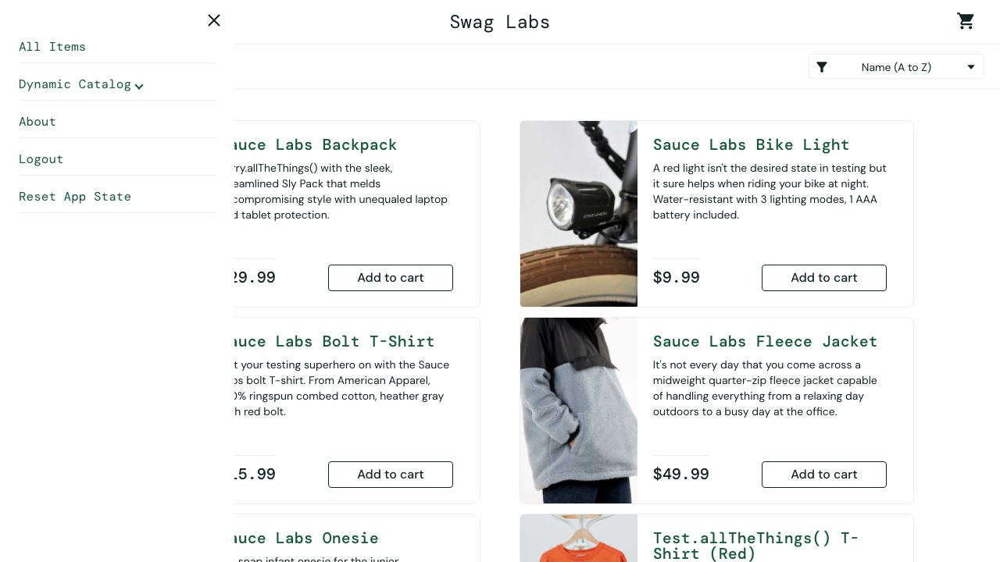

# Accessibility Testing

[](https://github.com/VincentJerico/accessibility-testing/actions/workflows/ci.yml)


Automated **and** keyboard accessibility testing against **WCAG 2.2 AA**, using Playwright and
axe-core, plus a documented audit of real findings.

> **Headline result:** axe-core found **0 violations** on every [SauceDemo](https://www.saucedemo.com)
> page. The keyboard and manual audit found **7 WCAG failures**, including one that stops a
> keyboard-only user from checking out. → [Read the audit](docs/FINDINGS.md)

Automated scanners catch roughly 30–40% of accessibility issues. This repo covers that part and
then tests what the scanner can't: keyboard reachability, visible focus, focus order and restoration,
focus hidden behind overlays, ARIA state, and semantic structure.

## Findings at a glance

| ID  | Issue                                                    | WCAG                             | Severity |
| --- | -------------------------------------------------------- | -------------------------------- | -------- |
| F-1 | Cart is not reachable by keyboard, which blocks checkout | 2.1.1 Keyboard (A)               | Critical |
| F-2 | No visible focus indicator anywhere                      | 2.4.7 Focus Visible (AA)         | Serious  |
| F-3 | Menu toggle doesn't expose open/closed state             | 4.1.2 Name, Role, Value (A)      | Serious  |
| F-7 | Focus lands on links hidden behind the open menu         | 2.4.11 Focus Not Obscured (AA)   | Serious  |
| F-4 | Closing the menu drops focus to `<body>`                 | 2.4.3 Focus Order (A)            | Moderate |
| F-5 | Page titles are `<span>`s; pages have no headings        | 1.3.1 Info & Relationships (A)   | Moderate |
| F-6 | Placeholder is the only visible label                    | 3.3.2 Labels or Instructions (A) | Moderate |

Each finding has evidence, reproduction steps, a recommended fix, and a **tracking test**. See
[docs/FINDINGS.md](docs/FINDINGS.md).

<p align="center">
  
  <br><sub>F-7: keyboard focus is on the Backpack image link, completely under the open menu.</sub>
</p>

## How it's tested

| Layer                  | Where                                  | What it proves                                                                               |
| ---------------------- | -------------------------------------- | -------------------------------------------------------------------------------------------- |
| **Scanner self-test**  | `tests/scanner-selftest.spec.ts`       | The gate rejects planted defects by rule name, so a green run can't be a vacuous pass        |
| **Scanner validation** | `tests/w3c-bad.spec.ts`                | Catches W3C's broken demo; its repaired twin fails only `target-size` (F-8)                  |
| **Automated scan**     | `tests/saucedemo.axe.spec.ts`          | WCAG 2.2 AA axe scan of each page **and its interactive states** (errors, open menu)         |
| **Keyboard & ARIA**    | `tests/saucedemo.keyboard.spec.ts`     | Regression guards for what works: tab order, Enter, `role="alert"`, landmarks, ARIA snapshot |
| **Known issues**       | `tests/saucedemo.known-issues.spec.ts` | One test per finding pins today's defect; it goes red when the defect is fixed               |

### Design decisions

- **The WCAG 2.2 AA tag set.** axe tags each WCAG version separately, so the scan uses
  `wcag2a, wcag2aa, wcag21a, wcag21aa, wcag22aa`. The `best-practice` tag is left out because those
  rules aren't conformance requirements.
- **An audit trail on every scan.** `expectNoViolations()` attaches the full axe JSON to the test
  report. On failure, the message lists each rule with its impact, help URL and sample nodes.
- **No rule is disabled.** The W3C demo's `target-size` gap (F-8) is pinned as the only rule its
  repaired pages fail, instead of being switched off.
- **Checks that axe can't do.** `isFocusEntirelyObscured()` samples `elementFromPoint` at the focused
  element's corners and centre to test **SC 2.4.11**, which has no axe rule.
- **No timing-based flakes.** Menu tests wait for the slide transition to finish
  (`getAnimations()`), so focus and geometry are read on a stable DOM. The suite passed 99/99 across
  3 repeated runs against the live sites.
- **Chromium only.** axe results depend on the DOM, not the browser. Keyboard focus behavior differs
  between browsers (Safari skips links on Tab by default), so a single engine keeps the audit
  deterministic.

## Getting started

```bash
npm install
npx playwright install chromium
npm test                 # everything
npm run test:axe         # @axe: automated scans + scanner validation
npm run test:keyboard    # @keyboard: keyboard audit
npm run report           # open the HTML report (includes axe JSON per scan)
```

## Scanning a page

```ts
import { test } from '@playwright/test';
import { expectNoViolations } from '../src/a11y.js';

test('checkout is accessible with a validation error shown', async ({ page }, testInfo) => {
  await page.goto('/checkout');
  await page.getByRole('button', { name: 'Continue' }).click(); // scan the error state too
  await expectNoViolations(page, testInfo, { exclude: ['#third-party-chat'] });
});
```

## Structure

```
accessibility-testing/
├── playwright.config.ts
├── src/
│   ├── a11y.ts          # axe wrapper: WCAG 2.2 AA tags, scan(), expectNoViolations()
│   ├── keyboard.ts      # reachableByTab(), isFocusEntirelyObscured(), describeFocus()
│   ├── saucedemo.ts     # login, keyboard menu helpers
│   └── targets.ts       # sites under test
├── tests/               # self-test · W3C validation · axe · keyboard · known issues
└── docs/
    ├── FINDINGS.md      # the audit report
    └── evidence/        # screenshots referenced by findings
```

## CI

[`.github/workflows/ci.yml`](.github/workflows/ci.yml) runs **lint · format · typecheck**, then the
accessibility suite in Chromium. The HTML report is uploaded as an artifact. It runs on every push and
PR, and **weekly** as well, because both sites under test are live and can change without this repo
changing.

## Limits

This audit is not a conformance claim. It did not include a screen reader pass, zoom/reflow testing,
or mobile testing. See [Not covered](docs/FINDINGS.md#not-covered-known-limits).
